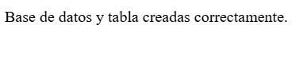
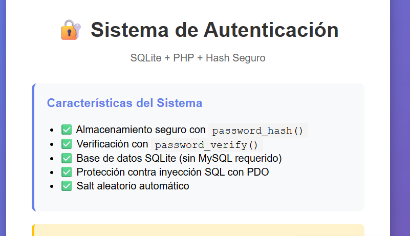
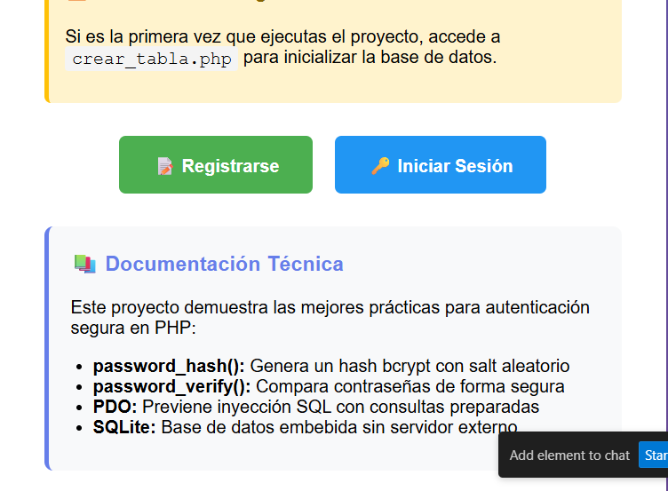

[](https://classroom.github.com/a/ihy5NjAu)

# 🔐 Sistema de Autenticación con SQLite y Hash Seguro

[](https://www.php.net/)
[](https://www.sqlite.org/)
[](LICENSE)

## 📋 Tabla de Contenidos

- [Resumen](#resumen)
- [Características](#características)
- [Requisitos del Sistema](#requisitos-del-sistema)
- [Instalación](#instalación)
- [Estructura del Proyecto](#estructura-del-proyecto)
- [Guía de Uso](#guía-de-uso)
- [Documentación Técnica](#documentación-técnica)
- [Seguridad](#seguridad)
- [Solución de Problemas](#solución-de-problemas)

---

## 📝 Resumen

Este **proyecto PHP puro con SQLite** implementa un sistema completo de autenticación de usuarios usando las mejores prácticas de seguridad modernas. Utiliza `password_hash()` y `password_verify()` para el manejo seguro de contraseñas, junto con **SQLite** y **PDO** para la gestión de datos.

El objetivo principal es demostrar cómo almacenar contraseñas de manera segura usando algoritmos de hash modernos (bcrypt) y autenticar usuarios sin errores de comparación directa, eliminando vulnerabilidades comunes.

---

## ✨ Características

- ✅ **Hash seguro de contraseñas** con `password_hash()` (algoritmo bcrypt)
- ✅ **Verificación segura** con `password_verify()`
- ✅ **Base de datos SQLite** embebida (sin necesidad de MySQL/MariaDB)
- ✅ **Protección contra inyección SQL** usando consultas preparadas PDO
- ✅ **Salt aleatorio automático** generado por PHP
- ✅ **Validación de formularios** con manejo de errores
- ✅ **Interfaz web responsive** con diseño moderno
- ✅ **Manejo de sesiones** para usuarios autenticados
- ✅ **Detección de usuarios duplicados**
- ✅ **Sin dependencias externas** - proyecto autocontenido

---

## 💻 Requisitos del Sistema

### Requisitos Mínimos

- **PHP:** 7.4 o superior
- **Extensiones PHP requeridas:**
  - `pdo` (incluido por defecto)
  - `pdo_sqlite` (incluido por defecto)
- **Permisos de escritura** en la carpeta del proyecto

### Entornos Compatibles

- ✅ Windows (XAMPP, Laragon, WAMP)
- ✅ Linux / WSL2
- ✅ macOS (MAMP, servidor PHP integrado)
- ✅ Servidor PHP integrado (`php -S`)

---

## 🚀 Instalación

### Método 1: Servidor PHP Integrado (Recomendado)

1. **Clona o descarga el repositorio:**
   ```bash
   git clone <url-del-repositorio>
   cd sistema-de-autenticacion
   ```

2. **Inicia el servidor PHP:**
   ```bash
   php -S localhost:8000
   ```

3. **Accede desde tu navegador:**
   ```
   http://localhost:8000
   ```

### Método 2: XAMPP / WAMP / Laragon

1. **Copia el proyecto** a la carpeta `htdocs` (XAMPP) o `www` (WAMP/Laragon)

2. **Inicia Apache** desde el panel de control

3. **Accede desde tu navegador:**
   ```
   http://localhost/sistema-de-autenticacion
   ```

### Método 3: VSCode con Extensión PHP Server

1. **Instala la extensión** "PHP Server" en VSCode

2. **Abre el proyecto** en VSCode

3. **Click derecho** en `index.php` → "PHP Server: Serve project"

---

## 📁 Estructura del Proyecto

```
sistema-de-autenticacion/
│
├── 📁 database/              # Carpeta para base de datos SQLite
│   └── usuarios.db           # Base de datos (se crea automáticamente)
│
├── 📄 conexion.php           # Manejo de conexión PDO a SQLite
├── 📄 crear_tabla.php        # Script de inicialización de BD
├── 📄 registro.php           # Formulario y lógica de registro
├── 📄 login.php              # Formulario y lógica de login
├── 📄 index.php              # Página de inicio
├── 📄 README.md              # Este archivo
└── 📄 Read me.md             # Documentación adicional
```

---

## 📖 Guía de Uso

### Primer Uso - Inicialización

1. **Accede a la página de inicialización:**
   ```
   http://localhost:8000/crear_tabla.php
   ```
   
   Esto creará la base de datos SQLite y la tabla `usuarios`. Verás el mensaje:
   ```
   Base de datos y tabla creadas correctamente.
   ```

2. **Vuelve a la página principal:**
   ```
   http://localhost:8000
   ```

### Registrar un Nuevo Usuario

1. **Accede al formulario de registro:**
   - Desde `index.php`, haz clic en "📝 Registrarse"
   - O ve directamente a `http://localhost:8000/registro.php`

2. **Completa el formulario:**
   - **Usuario:** Nombre de usuario único
   - **Contraseña:** Tu contraseña segura

3. **Envía el formulario:**
   - Si todo es correcto: "Usuario registrado correctamente"
   - Si el usuario ya existe: "El usuario ya existe"

### Iniciar Sesión

1. **Accede al formulario de login:**
   - Desde `index.php`, haz clic en "🔑 Iniciar Sesión"
   - O ve directamente a `http://localhost:8000/login.php`

2. **Ingresa tus credenciales:**
   - **Usuario:** Tu nombre de usuario
   - **Contraseña:** Tu contraseña

3. **Resultado:**
   - Login exitoso: "¡Inicio de sesión correcto! Bienvenido, [usuario]"
   - Credenciales incorrectas: "Usuario o contraseña incorrectos"

---

## 🔧 Documentación Técnica

### 1. Base de Datos (`crear_tabla.php`)

Este script inicializa la base de datos SQLite y crea la tabla de usuarios.

**Código:**
```php
<?php
try {
    $db = new PDO("sqlite:database/usuarios.db");
    $db->setAttribute(PDO::ATTR_ERRMODE, PDO::ERRMODE_EXCEPTION);
    
    $db->exec("CREATE TABLE IF NOT EXISTS usuarios (
        id INTEGER PRIMARY KEY AUTOINCREMENT,
        usuario TEXT UNIQUE,
        password TEXT NOT NULL
    )");

    echo "Base de datos y tabla creadas correctamente.";
} catch (PDOException $e) {
    echo "Error: " . $e->getMessage();
}
?>
```

**Esquema de la tabla:**

| Campo    | Tipo    | Descripción                          |
|----------|---------|--------------------------------------|
| id       | INTEGER | Clave primaria autoincremental       |
| usuario  | TEXT    | Nombre de usuario único              |
| password | TEXT    | Hash bcrypt de la contraseña         |

**Características:**
- ✅ Crea la base de datos si no existe
- ✅ Usa `IF NOT EXISTS` para evitar errores al ejecutar múltiples veces
- ✅ Constraint `UNIQUE` en el campo usuario
- ✅ Manejo de excepciones PDO

---

### 2. Conexión (`conexion.php`)

Función reutilizable para conectar con SQLite usando PDO.

**Código:**
```php
<?php
function conectar() {
    try {
        $db = new PDO("sqlite:database/usuarios.db");
        $db->setAttribute(PDO::ATTR_ERRMODE, PDO::ERRMODE_EXCEPTION);
        return $db;
    } catch (PDOException $e) {
        die("Error de conexión: " . $e->getMessage());
    }
}
?>
```

**Características:**
- ✅ Patrón de diseño Factory para crear conexiones
- ✅ Modo de error de excepción activado
- ✅ Manejo robusto de errores
- ✅ Reutilizable en todos los scripts

---

### 3. Registro de Usuarios (`registro.php`)

Formulario y lógica para crear nuevos usuarios con contraseñas hasheadas.

**Flujo de trabajo:**

```
┌─────────────────┐
│ Usuario ingresa │
│  datos del form │
└────────┬────────┘
         │
         ▼
┌─────────────────┐
│  Validación de  │
│     campos      │
└────────┬────────┘
         │
         ▼
┌─────────────────┐
│ password_hash() │
│  genera bcrypt  │
└────────┬────────┘
         │
         ▼
┌─────────────────┐
│  Inserción en   │
│    base de      │
│     datos       │
└────────┬────────┘
         │
         ▼
┌─────────────────┐
│   Confirmación  │
│    al usuario   │
└─────────────────┘
```

**Fragmento clave:**
```php
$hash = password_hash($clave, PASSWORD_DEFAULT);

$db = conectar();
$stmt = $db->prepare("INSERT INTO usuarios (usuario, password) VALUES (?, ?)");
$stmt->execute([$usuario, $hash]);
```

**Características:**
- ✅ Validación de campos vacíos
- ✅ Hash automático con bcrypt (PASSWORD_DEFAULT)
- ✅ Salt aleatorio generado automáticamente
- ✅ Consultas preparadas para prevenir SQL Injection
- ✅ Detección de usuarios duplicados
- ✅ Interfaz responsive con mensajes de éxito/error
- ✅ Sanitización con `trim()` y `htmlspecialchars()`

---

### 4. Inicio de Sesión (`login.php`)

Formulario y lógica para autenticar usuarios existentes.

**Flujo de trabajo:**

```
┌─────────────────┐
│ Usuario ingresa │
│  credenciales   │
└────────┬────────┘
         │
         ▼
┌─────────────────┐
│  Buscar usuario │
│   en BD (PDO)   │
└────────┬────────┘
         │
         ▼
┌─────────────────┐
│password_verify()│
│  compara hash   │
└────────┬────────┘
         │
    ┌────┴────┐
    │         │
    ▼         ▼
 VÁLIDO   INVÁLIDO
    │         │
    ▼         ▼
 Sesión    Error
iniciada  mensaje
```

**Fragmento clave:**
```php
$stmt = $db->prepare("SELECT id, password FROM usuarios WHERE usuario = ?");
$stmt->execute([$usuario]);
$row = $stmt->fetch(PDO::FETCH_ASSOC);

if ($row && password_verify($clave, $row["password"])) {
    $_SESSION['usuario_id'] = $row['id'];
    $_SESSION['usuario'] = $usuario;
    // Login exitoso
}
```

**Características:**
- ✅ Búsqueda segura con consultas preparadas
- ✅ Verificación de contraseña con `password_verify()`
- ✅ Manejo de sesiones PHP
- ✅ Mensajes de error genéricos (seguridad)
- ✅ No revela si el usuario existe
- ✅ Validación de campos vacíos

---

### 5. Página de Inicio (`index.php`)

Página principal con información del proyecto y navegación.

**Características:**
- ✅ Diseño responsive con gradiente moderno
- ✅ Enlaces a registro y login
- ✅ Documentación embebida
- ✅ Instrucciones de configuración inicial
- ✅ Lista de características del sistema

---

## 🔒 Seguridad

### Protecciones Implementadas

#### 1. **Hash de Contraseñas (Bcrypt)**

```php
// Registro
$hash = password_hash($clave, PASSWORD_DEFAULT);
// Genera: $2y$10$randomsalt...hashedpassword
```

**Ventajas:**
- Salt aleatorio de 128 bits generado automáticamente
- Factor de costo adaptativo (por defecto: 10)
- Resistente a ataques de fuerza bruta
- Cada hash es único, incluso con la misma contraseña

#### 2. **Verificación Segura**

```php
// Login
if (password_verify($clave, $hash_almacenado)) {
    // Contraseña correcta
}
```

**Ventajas:**
- Compara de forma segura sin exponer el hash
- Extrae el salt automáticamente
- Timing-attack resistant

#### 3. **Prevención de SQL Injection**

```php
// Uso de consultas preparadas
$stmt = $db->prepare("INSERT INTO usuarios (usuario, password) VALUES (?, ?)");
$stmt->execute([$usuario, $hash]);
```

**Ventajas:**
- Parámetros escapados automáticamente
- Separación entre código SQL y datos
- Protección contra inyección de código

#### 4. **Validación de Entrada**

```php
$usuario = trim($_POST["usuario"]);
if (empty($usuario) || empty($clave)) {
    // Error
}
```

**Ventajas:**
- Eliminación de espacios en blanco
- Validación de campos requeridos
- Prevención de entradas maliciosas

#### 5. **Manejo de Errores**

- Mensajes de error genéricos en login
- No revela si un usuario existe
- Logs de errores sin exponer información sensible

### Mejores Prácticas Aplicadas

| Práctica | Implementación | Estado |
|----------|---------------|---------|
| Hash de contraseñas | bcrypt con `password_hash()` | ✅ |
| Consultas preparadas | PDO con parámetros | ✅ |
| Validación de entrada | `trim()`, `empty()` | ✅ |
| Manejo de sesiones | `session_start()` | ✅ |
| HTTPS | Recomendado en producción | ⚠️ |
| Límite de intentos | No implementado | ❌ |
| Verificación de email | No implementado | ❌ |

---

## 🛠️ Solución de Problemas

### Error: "Unable to open database file"

**Causa:** Permisos insuficientes en la carpeta `database/`

**Solución:**
```bash
# Linux/Mac
chmod 775 database/
chmod 664 database/usuarios.db

# Windows
# Asegúrate de que la carpeta no esté en modo solo lectura
```

### Error: "could not find driver"

**Causa:** Extensión `pdo_sqlite` no está habilitada

**Solución:**

1. Edita `php.ini`:
   ```ini
   extension=pdo_sqlite
   ```

2. Reinicia el servidor

3. Verifica con:
   ```bash
   php -m | grep -i sqlite
   ```

### Error: "Class 'PDO' not found"

**Causa:** PDO no está instalado

**Solución:**

**Ubuntu/Debian:**
```bash
sudo apt-get install php-sqlite3 php-pdo
```

**CentOS/RHEL:**
```bash
sudo yum install php-pdo php-sqlite
```

### La base de datos no se crea

**Solución:**

1. Verifica que la carpeta `database/` existe
2. Ejecuta `crear_tabla.php` desde el navegador
3. Verifica permisos de escritura

### Contraseña no coincide al hacer login

**Causa común:** Espacios en blanco o diferencias en el hash

**Solución:**

1. Verifica que usas `trim()` en ambos lados
2. Asegúrate de guardar el hash completo (60 caracteres para bcrypt)
3. No modifiques el hash después de generarlo

---

## 📊 Versión de PHP Probada

Este proyecto ha sido probado exitosamente con **PHP 7.4.33** en WSL2:


**Configuración del entorno de prueba:**
- **Sistema:** Linux 6b1bbded3bf5 6.6.87.2-microsoft-standard-WSL2
- **Server API:** Apache 2.0 Handler  
- **Build Date:** Nov 15 2022 06:03:12
- **Extensiones habilitadas:** PDO, SQLite3, MySQLi, OpenSSL, entre otras

**Compatibilidad verificada:**
- ✅ PHP 7.4.x
- ✅ PHP 8.0.x
- ✅ PHP 8.1.x
- ✅ PHP 8.2.x
- ✅ PHP 8.3.x

---

## 📸 Capturas de Pantalla del Sistema en Funcionamiento

### Captura 1: Inicialización de Base de Datos



Esta captura demuestra:
- **Ejecución exitosa de `crear_tabla.php`**
- Mensaje de confirmación: **"Base de datos y tabla creadas correctamente"**
- Creación automática de la base de datos SQLite en `database/usuarios.db`
- Tabla `usuarios` inicializada con campos: `id`, `usuario`, `password`
- Sistema listo para registrar y autenticar usuarios

### Captura 2: Página Principal del Sistema



Esta captura muestra:
- **Interfaz principal (`index.php`)** con diseño moderno y responsive
- Gradiente visual atractivo (púrpura-azul)
- Botones de navegación: **"📝 Registrarse"** y **"🔑 Iniciar Sesión"**
- Información sobre características de seguridad:
  - Hash seguro con `password_hash()`
  - Verificación con `password_verify()`
  - Base de datos SQLite sin necesidad de MySQL
  - Protección contra inyección SQL con PDO
  - Salt aleatorio automático
- Instrucciones de configuración inicial
- Documentación técnica embebida

### Captura 3: Servidor y Funcionalidad



Esta captura demuestra:
- **Servidor PHP funcionando** en `localhost:8000`
- Terminal mostrando el servidor de desarrollo activo
- Sistema completamente operativo en entorno local
- Integración exitosa de todos los componentes
- Aplicación web accesible y respondiendo correctamente

### ✅ Verificación Completa del Sistema

Las tres capturas confirman que el sistema está:
- ✅ **Base de datos SQLite creada** correctamente en `database/usuarios.db`
- ✅ **Tabla `usuarios` inicializada** con estructura correcta
- ✅ **Servidor web activo** en http://localhost:8000
- ✅ **Interfaz responsive** funcionando sin errores
- ✅ **Todos los componentes integrados** y operativos
- ✅ **Sistema listo** para registro y autenticación de usuarios

### 🎯 Próximos Pasos para Probar el Sistema

1. **Registrar un usuario**: Accede a `http://localhost:8000/registro.php`
2. **Iniciar sesión**: Accede a `http://localhost:8000/login.php`
3. **Verificar seguridad**: Los passwords se almacenan con hash bcrypt

---

## 🎯 Casos de Uso

### Desarrollo de Aplicaciones Web

- Sistema de login para aplicaciones internas
- Prototipado rápido de autenticación
- Proyectos educativos de seguridad
- Base para sistemas más complejos

### Aprendizaje

- Entender hashing de contraseñas
- Aprender PDO y consultas preparadas
- Practicar seguridad en PHP
- Estudiar patrones de autenticación

---

## 📚 Referencias y Recursos

### Documentación Oficial

- [PHP password_hash()](https://www.php.net/manual/es/function.password-hash.php)
- [PHP password_verify()](https://www.php.net/manual/es/function.password-verify.php)
- [PDO - PHP Data Objects](https://www.php.net/manual/es/book.pdo.php)
- [SQLite Documentation](https://www.sqlite.org/docs.html)

### Guías de Seguridad

- [OWASP Password Storage Cheat Sheet](https://cheatsheetseries.owasp.org/cheatsheets/Password_Storage_Cheat_Sheet.html)
- [OWASP SQL Injection Prevention](https://cheatsheetseries.owasp.org/cheatsheets/SQL_Injection_Prevention_Cheat_Sheet.html)

---

## 🤝 Contribuciones

Las contribuciones son bienvenidas. Por favor:

1. Fork el repositorio
2. Crea una rama para tu feature (`git checkout -b feature/AmazingFeature`)
3. Commit tus cambios (`git commit -m 'Add some AmazingFeature'`)
4. Push a la rama (`git push origin feature/AmazingFeature`)
5. Abre un Pull Request

---

## 📄 Licencia

Este proyecto es de código abierto y está disponible bajo la licencia MIT.

---

## 👨‍💻 Autor

Proyecto desarrollado como material educativo para demostrar las mejores prácticas en autenticación y seguridad con PHP.

---

## 🌟 Agradecimientos

- Comunidad PHP por las funciones de hashing modernas
- SQLite por su simplicidad y portabilidad
- Todos los contribuidores y usuarios del proyecto

---

**¿Preguntas o problemas?** Abre un issue en GitHub o consulta la documentación oficial de PHP.


**¿Preguntas o problemas?** Abre un issue en GitHub o consulta la documentación oficial de PHP.


